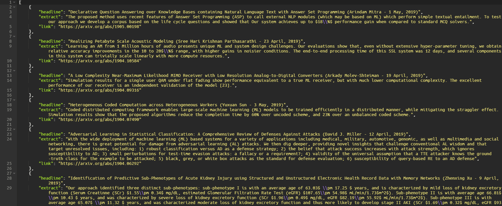
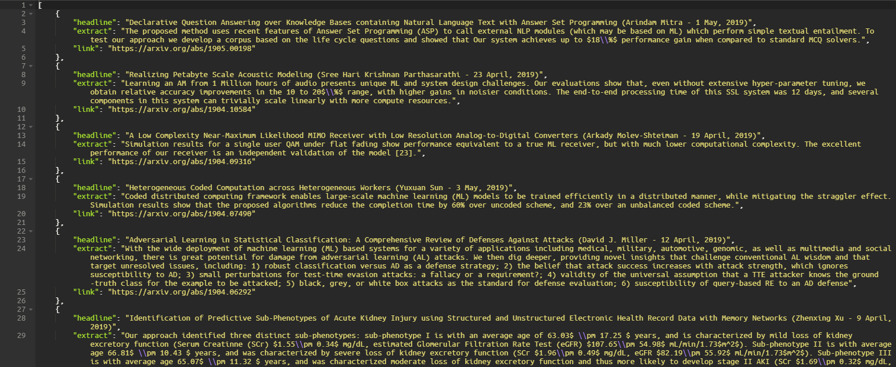

# SOTA server

This script runs using Python 3. It requires `nltk`, `six`, `pyspellchecker` and `django`. 
The data is returned in Json format.
example:
```json
[
    {
        "headline": "Declarative Question Answering over Knowledge Bases containing Natural Language Text with Answer Set Programming (Arindam Mitra - 1 May, 2019)",
        "extract": "The proposed method uses recent features of Answer Set Programming (ASP) to call external NLP modules (which may be based on ML) which perform simple textual entailment. To test our approach we develop a corpus based on the life cycle questions and showed that Our system achieves up to $18\\%$ performance gain when compared to standard MCQ solvers.",
        "link": "https://arxiv.org/abs/1905.00198"
    },
    
    ...
    
    {
        "headline": "Realizing Petabyte Scale Acoustic Modeling (Sree Hari Krishnan Parthasarathi - 23 April, 2019)",
        "extract": "Learning an AM from 1 Million hours of audio presents unique ML and system design challenges. Our evaluations show that, even without extensive hyper-parameter tuning, we obtain relative accuracy improvements in the 10 to 20$\\%$ range, with higher gains in noisier conditions. The end-to-end processing time of this SSL system was 12 days, and several components in this system can trivially scale linearly with more compute resources.",
        "link": "https://arxiv.org/abs/1904.10584"
    }
]
```
follow the following steps:

Step 1: clone this repo, and go inside that repo:

```bash
$ git clone [HTTPS or SSH linnk to this repo]
$ cd sota_server
```

Step 2: install package:

```bash
$ pip install -r requirements.txt
```
Step 3: run:

```bash
$ python manage.py runserver 8000
```
On Windows, due to encoding errors, the script may cause issues when run on the command line. It is recommended to use `pip install win-unicode-console --upgrade` prior to launching the script. If you get UnicodeEncodingError, you must install the above.

In MacOS, you can get the SSL erro
``` bash
[nltk_data] Error loading punkt: <urlopen error [SSL:
[nltk_data]     CERTIFICATE_VERIFY_FAILED] certificate verify failed:
[nltk_data]     unable to get local issuer certificate (_ssl.c:1045)>

```
this will be fixed by reinstalling certificates
``` bash
$ /Applications/Python\ 3.x/Install\ Certificates.command
```

## Usage

To query for a certain keyword, run:

```
http://127.0.0.1:8000/api?keyword=[keyword]&num_results=[num_results]
```
For example:

```
http://127.0.0.1:8000/api?keyword=ml&num_results=10
```

or
```
http://127.0.0.1:8000/api?keyword=language+model&num_results=10
```


## Thank

https://github.com/chiphuyen/sotawhat
